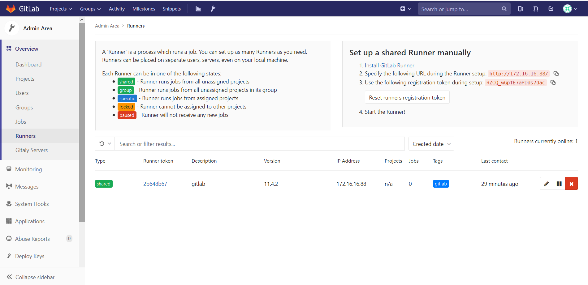
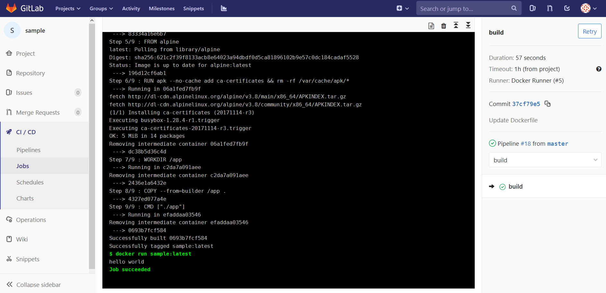

# 部署GitLab

## 安装依赖包

```bash
[root@gitlab ~]# yum install -y curl policycoreutils-python openssh-server
```

## 安装Docker-ce

高版本的docker-ce包含很多新特性，建议部署docker-ce版本替代CentOS源中的docker；

```bash
[root@gitlab ~]# yum remove docker \
 docker-client \
 docker-client-latest \
 docker-common \
 docker-latest \
 docker-latest-logrotate \
 docker-logrotate \
 docker-selinux \
 docker-engine-selinux \
 docker-engine
```

* 卸载系统的docker相关软件包；

```bash
[root@gitlab ~]# yum install -y yum-utils device-mapper-persistent-data lvm2
[root@gitlab ~]# yum-config-manager --add-repo https://download.docker.com/linux/centos/docker-ce.repo
[root@gitlab ~]# yum install docker-ce
[root@gitlab ~]# vi /etc/docker/daemon.json
{
  "insecure-registries" : ["172.16.16.249"]
}
[root@gitlab ~]# systemctl enable docker && systemctl start docker
```

* 安装docker-ce，并配置docker使用私有镜像仓库；

## 开放防火墙策略允许80端口访问

```bash
[root@gitlab ~]# firewall-cmd --permanent --add-service=http
success
[root@gitlab ~]# firewall-cmd --reload
success
```

* 开通gitlab防火墙端口；

## 安装GitLab软件

```bash
[root@gitlab ~]# curl -sS https://packages.gitlab.com/install/repositories/gitlab/gitlab-ce/script.rpm.sh |  bash
[root@gitlab ~]# EXTERNAL_URL="http://172.16.16.88" yum install -y gitlab-ce
```

## 配置gitlab-runner

```bash
[root@gitlab ~]# curl -L https://packages.gitlab.com/install/repositories/runner/gitlab-runner/script.rpm.sh | bash
[root@gitlab ~]# yum install gitlab-runner
```



```bash
[root@gitlab ~]# vi /etc/gitlab-runner/config.toml
concurrent = 5
check_interval = 0

[session_server]
  session_timeout = 1800

[[runners]]
  name = "Docker Runner"
  url = "http://172.16.16.88/"
  token = "388a57b102df7197bd3428008f5114"
  executor = "docker"
  [runners.docker]
    tls_verify = false
    image = "docker:stable"
    privileged = true
    disable_entrypoint_overwrite = false
    oom_kill_disable = false
    disable_cache = false
    volumes = ["/var/run/docker.sock:/var/run/docker.sock", "/cache"]
    shm_size = 0
  [runners.cache]
    [runners.cache.s3]
    [runners.cache.gcs]

```

```bash
[root@gitlab ~]# gitlab-runner start
```

## 测试gitlab-ci

* 创建git仓库名字叫sample；
* 创建app.go文件，内容如下：

```go
package main
import "fmt"
func main() {
    fmt.Println("hello world")
}
```

* 创建Dockerfile

```bash
FROM golang:alpine AS builder

WORKDIR /app
ADD . /app
RUN cd /app && go build -o app -v

FROM alpine
RUN apk --no-cache add ca-certificates && rm -rf /var/cache/apk/*

WORKDIR /app
COPY --from=builder /app .
CMD ["./app"]
```

* 创建.gitlab-ci.yml文件

```yaml
build:
  stage: build
  script:
    - docker build --pull -t sample:latest .
    - docker run sample:latest
```

* 进入CI/CD->Jobs->点开任务查看执行情况，若成功效果如下：

