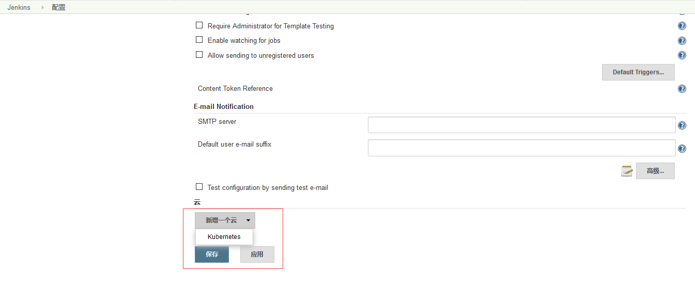

# Kubernetes&Jenkins CI/CD Pipeline

## 插件列表

* [Build Timestamp Plugin](https://wiki.jenkins.io/display/JENKINS/GitLab+Plugin)
* [GitLab Plugin](https://wiki.jenkins.io/display/JENKINS/GitLab+Plugin)
* [Kubernetes plugin](https://github.com/jenkinsci/kubernetes-plugin)
* [Kubernetes Continuous Deploy Plugin](https://wiki.jenkins.io/display/JENKINS/Kubernetes+Continuous+Deploy+Plugin)

## 配置kubernetes plugin

打开面板"系统管理"->"系统设置"->"增加一个云"，按如下进行配置：




## 配置gitlab plugin

打开面板"系统管理"->"系统设置"，按如下进行配置：


## Build Timestamp Plugin配置


## Dockerfile

```dockerfile
FROM 172.16.16.249/library/maven/maven:3.6.0-jdk-8-alpine AS builder
MAINTAINER linxufang@funo.com.cn

WORKDIR /app
ADD . /app
RUN mvn install

FROM 172.16.16.249/library/openjdk/openjdk:8-jre-alpine
RUN apk --no-cache add ca-certificates && rm -rf /var/cache/apk/*
WORKDIR /app
COPY --from=builder /app/target/devopsdemo-0.9.jar devopsdemo-0.9-docker.jar
ENTRYPOINT ["java","-jar","devopsdemo-0.9-docker.jar"]
EXPOSE 8001
```

## Pipeline

```jenkinsfile
podTemplate(label: 'jenkins-slave',containers: [
    containerTemplate(name: 'docker', image: '172.16.16.249/library/docker/docker:stable', ttyEnabled: true, command: 'cat'),
    containerTemplate(name: 'jnlp', image: '172.16.16.249/library/jenkins/jnlp-slave:latest', args: '${computer.jnlpmac} ${computer.name}')
],volumes: [
    hostPathVolume(mountPath: '/var/run/docker.sock', hostPath: '/var/run/docker.sock'),
])
{
    node('jenkins-slave') {
        stage("SCM Checkout"){
            git credentialsId: 'gitlab-dev', url: 'http://172.16.16.88/dev/java-demo.git'
        }
        stage("Docker Build"){
            container('docker') {
                sh "docker build -t 172.16.16.249/library/java-demo:$BUILD_TIMESTAMP ."
                sh "docker tag 172.16.16.249/library/java-demo:$BUILD_TIMESTAMP 172.16.16.249/library/java-demo:latest"
            }
        }
        stage("Push Images"){
            container('docker') {
                withDockerRegistry(credentialsId: 'Harbor-Registry', url: 'http://172.16.16.249') {
                    sh "docker push 172.16.16.249/library/java-demo:$BUILD_TIMESTAMP"
                    sh "docker push 172.16.16.249/library/java-demo:latest"
                    sh '''docker rmi $(docker images -f 'dangling=true' -q)'''
                }
            }
        stage("Deploy to Kubernetes"){
            container('jnlp'){
                kubernetesDeploy configs: 'java-demo.yaml', dockerCredentials: [[credentialsId: 'Harbor-Registry', url: 'http://172.16.16.249']], kubeConfig: [path: ''], kubeconfigId: 'kubernetes-kubeconfig', secretName: '', ssh: [sshCredentialsId: '*', sshServer: ''], textCredentials: [certificateAuthorityData: '', clientCertificateData: '', clientKeyData: '', serverUrl: 'https://']
            }
        }
        }
    }
}
```

## Deployment Yaml

```yaml
apiVersion: extensions/v1beta1
kind: Deployment
metadata:
  name: java-demo
spec:
  replicas: 1
  template:
    metadata:
      labels:
        app: java-demo
    spec:
      containers:
      - name: java-demo
        image: 172.16.16.249/library/java-demo:$BUILD_TIMESTAMP
        ports:
        - containerPort: 8001
      imagePullSecrets:
      - name: $KUBERNETES_SECRET_NAME
---
kind: Service
apiVersion: v1
metadata:
  name: java-demo
spec:
  selector:
    app: java-demo
  type: NodePort
  ports:
    - port: 8001
      targetPort: 8001
      nodePort: 32000
```